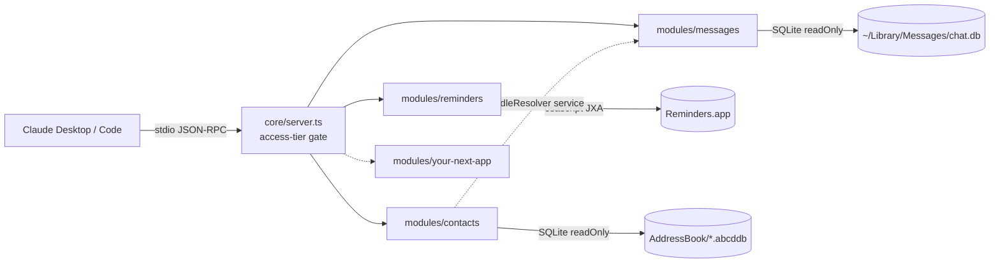

# apple-mcp

[](https://github.com/mwalburn/apple-mcp/actions/workflows/ci.yml)


Local, read-only MCP server for Apple apps on macOS. Modules: **Reminders**, **Messages**, **Contacts**.
Runs over stdio as a child process of Claude Desktop / Cowork / Claude Code. Nothing leaves the Mac except what the model reads through tool calls.



## Status: what is and isn't verified

Built and tested on Linux, so be precise about what that covers:

| Layer | State |
|---|---|
| MCP protocol, tool registration, schemas, access gating | Tested end to end (in-memory and real stdio) |
| Messages: SQL, date handling, `attributedBody` decoding, search, read-only enforcement | Tested against a fixture DB mirroring Apple's schema |
| Reminders: filtering, sorting, arg passing, error mapping | Tested with a faked `osascript` |
| Contacts: store discovery, merge, search ranking, name resolution, Messages integration | Tested against a fixture AddressBook |
| Reminders JXA against Reminders.app | Confirmed working on macOS 27 (2026-09-20) |
| Messages against a real `chat.db` | Confirmed working on a 332k-message history. The body decoder is still a heuristic over an undocumented format: a message with `text: null` and `hasAttachments: false` is the symptom of a miss |
| Contacts against a real AddressBook | Confirmed working: 6,217 contacts across 8 stores |
| Urgent flag join against the real Reminders store | **Untested.** Column name confirmed on macOS 27; which id column matches is not. `npm run doctor` reports the match rate |

## Install

Requires macOS and Node >= 22.13 (uses the built-in `node:sqlite`, so no native compilation).

```sh
npm install
npm run build
npm test
npm run doctor     # triggers permission prompts, reports per-module OK/FAIL with timings; adopts APPLE_MCP_* env from Claude's config
```

## Permissions

| Module | Grant | Where |
|---|---|---|
| reminders | Host app may control Reminders | Prompted on first call. Later: Privacy & Security > Automation |
| messages, contacts | **Full Disk Access for the `node` binary** | Privacy & Security > Full Disk Access > +, then Cmd+Shift+G and enter the real path |

Observed behaviour, which differs from what most guides say: when Claude Desktop spawns the server, macOS attributes file access to the `node` executable, not to Claude.app. Granting Claude.app alone does not work. (From a terminal, the terminal's own grant is enough, which is why `npm run doctor` can pass while Claude still fails.)

- Grant the **resolved** binary, e.g. `/opt/homebrew/Cellar/node@24/24.21.0/bin/node`. Symlinks such as `/opt/homebrew/opt/node@24/bin/node` are resolved by macOS and cannot hold a grant.
- The grant is pinned to that exact file. A `brew upgrade` of node installs a new binary and Messages/Contacts will fail until you re-grant. Either `brew pin node@24`, or `cp` the binary to `~/apple-mcp/bin/node`, grant that copy, and point the Claude config at it. The copy also scopes the access to this server instead of every node script you run.
- Fully quit the host app (Cmd+Q) after changing grants.

Full Disk Access is broad: whatever holds it can read your whole home directory. There is no narrower grant for `chat.db`.

## Register

**Claude Desktop / Cowork**: `~/Library/Application Support/Claude/claude_desktop_config.json`

```json
{
  "mcpServers": {
    "apple": {
      "command": "node",
      "args": ["/ABSOLUTE/PATH/apple-mcp/dist/index.js"],
      "env": { "APPLE_MCP_ACCESS": "read", "APPLE_MCP_REMINDERS_EXCLUDE": "Mela,Groceries" }
    }
  }
}
```

Use an absolute path to `node` if Claude can't find it (GUI apps don't inherit your shell PATH; common with nvm/asdf).

**Claude Code**

```sh
claude mcp add apple -- node /ABSOLUTE/PATH/apple-mcp/dist/index.js
```

Docs: https://modelcontextprotocol.io/quickstart/user and https://docs.claude.com/en/docs/claude-code/mcp

## Tools

| Tool | Purpose |
|---|---|
| `reminders_list_lists` | Lists with incomplete counts |
| `reminders_list` | By list, status, due window, flagged, changed-since. Returns `priority`, `flagged`, `urgent`. Sorted by due date |
| `reminders_search` | Substring over title + notes |
| `reminders_get` | Full detail for one id |
| `messages_list_chats` | Conversations by recency, with participants |
| `messages_get_chat` | One conversation by `chatId` or handle (phone matches on last 10 digits) |
| `messages_recent` | Latest across all chats |
| `messages_search` | Substring search, scoped by chat/handle/contact/date |
| `messages_since` | Incremental fetch above a watermark, for scheduled routines. See docs/recon-routine.md |
| `reminders_status` | Bulk status for tracked reminder ids; distinguishes completed from deleted |
| `contacts_search` | By name, nickname, organization, phone or email. Returns handles usable in the messages tools |
| `contacts_resolve` | Phone/email list to names |

Every message carries `id` (ROWID: monotonic, use as a watermark) and `guid` (globally stable, use as a dedup key).

**Name disambiguation.** Exact full name wins; then whole-word matches suppress substring noise ("Hope" no longer matches "Orthopedics"); then, if exactly one candidate has exchanged messages in the last 90 days, that one is chosen and the response says so via `matchedBy: "recent-activity"` and `alsoMatched`. Two active candidates is still an error that lists both with last-contact dates.

**Redaction.** Message text is masked for credentials ("password: ..."), one-time codes, card numbers, SSNs and secret-sharing links (1Password, Bitwarden Send, and similar) before it leaves the server; affected messages carry `redacted: true`. Search still matches on the raw text but returns the masked form. This is pattern-based mitigation: an unusually phrased secret will get through.

With contacts enabled, every message carries `senderName`, chat participants carry `name`, and `messages_get_chat` / `messages_search` accept `contact: "Full Name"`. An ambiguous name returns the candidates rather than guessing. If contacts are unreadable, messages still work and return raw handles.

## Configuration

| Env var | Default | Effect |
|---|---|---|
| `APPLE_MCP_ACCESS` | `read` | `read` \| `write` \| `delete`. Tools above the tier are never registered |
| `APPLE_MCP_MODULES` | all | Comma list, e.g. `reminders` |
| `APPLE_MCP_REMINDERS_EXCLUDE` | none | Denylist of Reminders lists (names or ids, comma-separated) skipped by all-list scans. Everything else, including lists created later, is in scope. A list requested by name is always readable |
| `APPLE_MCP_REMINDERS_STORE_DIR` | Reminders group container | Override the Core Data store directory used for the urgent flag |
| `APPLE_MCP_JXA_TIMEOUT_MS` | `60000` | Per-call timeout for Apple Events scripts |
| `APPLE_MCP_REDACT` | `on` | `off` disables masking of passwords, one-time codes, card numbers and SSNs in message text |
| `APPLE_MCP_MESSAGES_DB` | `~/Library/Messages/chat.db` | Override path (tests, or a copied snapshot) |
| `APPLE_MCP_CONTACTS_DIR` | `~/Library/Application Support/AddressBook` | Override AddressBook directory |

## Known limitations

- **`urgent` comes from a private store.** Reminders.app's Urgent toggle is not in AppleScript or public EventKit, so it is read (read-only) from `ZREMCDREMINDER.ZISURGENTSTATEENABLEDFORCURRENTUSER` in the app's local SQLite stores and joined to JXA results by id. `null` means unknown, never false. `npm run doctor` prints the join rate; anything under 100% means Apple changed the id encoding. An OS update can break this without warning, and only this field.
- **`messages_since` sees new rows only.** A message edited or unsent after it was processed keeps its ROWID and will not reappear.
- **Recurring reminders never report `completed`.** Completing one advances its due date on the same id. A one-way sync sees that as a due-date edit, which is the right outcome: the mirrored task rolls forward.
- **Name matching is on the last 10 digits** of a phone number, so two numbers differing only by country code collide. Contacts present in several accounts are merged by exact display name.
- **A contact or handle filter includes group chats** that person is in. Use `chatId` to isolate one thread.
- **Message search is a scan**, not an index. Bodies are in a binary column SQL can't search. Scope by date or handle on large histories.
- **Attachments**: `hasAttachments` flag only. No filenames or content.
- **Edited/unsent messages, replies threading, group rename events**: not modelled.
- **Reminders cost is fixed per list, not per reminder.** The scripts avoid `whose()` filters, which Reminders re-evaluates for every property read (9 full scans of a list with thousands of completed items took over a minute). Instead each list costs one Apple Event to read completion, and eight more only if it holds anything wanted. If it becomes a problem, replace the JXA calls with a small Swift/EventKit helper behind the same tool interface; nothing above the module changes.
- **Messages in iCloud**: only messages synced down to this Mac are visible.

## Adding a module

1. Create `src/modules/<app>/index.ts` exporting an `AppModule`.
2. Add it to the array in `src/modules/index.ts`.

That's the whole contract. The server handles registration, schema validation, access gating, error formatting and the doctor check.

```ts
import { z } from "zod";
import { defineTool, type AppModule } from "../../core/types.js";

const SEARCH = `
const app = Application("Notes");
const hits = app.notes.whose({ name: { _contains: args.query } });
const ids = hits.id(), names = hits.name(), mod = hits.modificationDate();   // bulk: one Apple Event each
return ids.slice(0, args.limit).map((id, i) => ({ id, name: names[i], modifiedAt: new Date(mod[i]).toISOString() }));
`;

export const notesModule: AppModule = {
  id: "notes",
  description: "Apple Notes (read-only) via JXA",
  permissions: ["Automation: host app -> Notes"],
  check: async (ctx) => `${(await ctx.jxa<number>(`return Application("Notes").notes.length;`))} notes`,
  tools: [
    defineTool({
      name: "notes_search",
      title: "Search notes by title",
      description: "Case-insensitive title match.",
      access: "read",
      input: { query: z.string().min(1), limit: z.number().int().min(1).max(100).default(20) },
      handler: (a, ctx) => ctx.jxa(SEARCH, a),
    }),
  ],
};
```

Rules the core relies on:

- **Never interpolate input into a JXA script or SQL string.** JXA gets data through `args`; SQL through `?` parameters.
- Fetch Apple Events properties in bulk (`collection.name()`), never per-object in a loop.
- Mark every mutating tool `access: "write"` or `"delete"`. It stays invisible until `APPLE_MCP_ACCESS` is raised.
- Throw `UserFacingError(message, hint)` for anything the user can fix (permissions, bad scope).
- Log to stderr only. stdout is the protocol.
- Modules never import each other. To share a capability, publish it through `AppModule.provide` and consume it from `ctx.services`, always as optional (see how contacts feeds messages).

## Layout

```
src/
  index.ts            stdio entrypoint
  doctor.ts           permission / connectivity self-check
  context.ts          real ModuleContext (JXA runner, env, home dir)
  core/               types, JXA runner, config, server builder
  modules/
    index.ts          the registry
    reminders/        JXA
    messages/         SQLite + attributedBody decoder
    contacts/         SQLite over AddressBook; publishes the handleResolver service
test/                 vitest: fixture chat.db, faked osascript, in-memory MCP client
```
