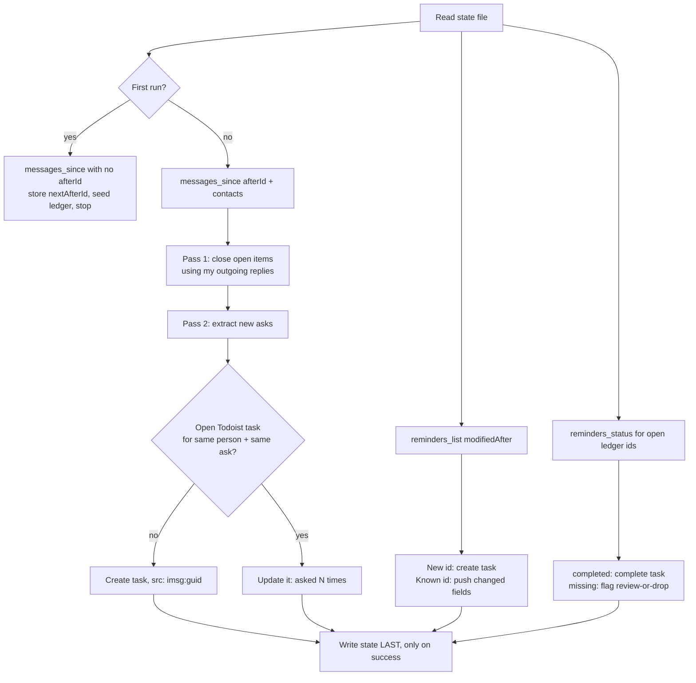

# Evening Life Recon: Apple section (draft)

Drop-in section for the scheduled routine. One-way only: Apple is read, Todoist is written. Nothing here ever writes to Reminders or Messages, and the server cannot.



## State file: `/apple-recon-state.md` (separate from personal-life-sync, which is near its size cap)

IDs and dispositions only. Never message text, never reminder titles. Meaning lives in the Todoist task.

```yaml
messages_after_id: 380733          # from nextAfterId
reminders_last_run: 2026-09-20T23:00:00Z
contacts: [Hope Walburn, Aria Walburn, Noah Walburn, Dan Trudeau, Damian Kastbauer, Rachael McGraw, Marriah LaVigne, Michelle San Cartier]
todoist_landing_project: inbox            # every task this section creates lands in the Todoist Inbox
message_items:                     # one row per action item
  - guid: <message guid of the ask>   # dedup key
    todoist: <task id>
    state: open | closed | closed_in_todoist
    asks: 1                        # bumped when the same ask repeats
reminder_items:
  - reminder: <reminder id>
    todoist: <task id>
    seen_modified: <modifiedAt last pushed>
    seen_urgent: true | false | null   # last urgent value acted on
    urgent_reminder: <todoist reminder id>   # present only while the task carries an urgent Todoist reminder
    state: open | completed | deleted_flagged | closed_in_todoist
```

## Messages

1. `messages_since { afterId: messages_after_id, contacts }`. If `hasMore`, keep calling with the returned `nextAfterId` until false.
2. If `unresolved` is non-empty, put it in the report. Do not abort.
3. **Pass 1, closures.** For each `open` message item, read the new messages in that chat. If my outgoing messages or their reply show it handled, complete the Todoist task and set `closed`. Only close on clear evidence; "Checking." is not completion.
4. **Pass 2, new asks.** An ask is a direct request, a question still unanswered at the end of the delta, or a commitment I made ("I'll cancel Honda"). Skip logistics already resolved inside the same delta.
5. **Before creating**, search open Todoist tasks across ALL projects (not just the Inbox, since I re-file) for `src: imsg:` and that person. Same ask: increment `asks`, add "asked again <date>" to the task, raise priority at 3+. Different ask: create.
6. New task goes to the Todoist Inbox (`projectId: "inbox"`). Content is the action in my words; description is `src: imsg:<guid>` plus the person's name. No quoted message text. Due date only if the message states one.
7. If the Todoist task was completed by me outside the routine, set `closed_in_todoist` and stop tracking. Never reopen.

## Reminders (one-way, Reminders -> Todoist)

1. `reminders_list { status: "all", modifiedAfter: reminders_last_run, limit: 500 }`. No `list` argument, so every list not on the server denylist is covered, including lists created since the last run. Put `listsScanned` in the report the first time a new name appears.
2. Unknown id and not completed: create a task in the Todoist Inbox (`projectId: "inbox"`), `src: reminder:<id>`, carry title, notes, due date, and the importance fields below.
3. Known id with `modifiedAt > seen_modified`: push only title, notes and due date. Never touch project, priority, labels or section: once I move a task out of the Inbox it stays where I put it.
4. `reminders_status { ids: [all open reminder_items] }` (also returns `urgent`; apply the importance mapping on any change):
   - `completed: true` -> complete the Todoist task, state `completed`.
   - `found: false` -> leave the task open, state `deleted_flagged`, list under "Review or drop". Report once.
5. Todoist task completed by me while the reminder is still open: state `closed_in_todoist`, mention once, never recreate.
6. Recurring reminders show up as a due-date change on the same id. Step 3 handles that: the task's due date rolls forward.

### Importance mapping (Reminders -> Todoist)

| Reminders | Todoist | Notes |
|---|---|---|
| `priority` 1 / 5 / 9 / 0 | p1 / p2 / p3 / p4 | Set on create. Afterwards pushed only if it changed in Reminders |
| `flagged: true` | label `flagged` | A label, not a priority bump, so flagged and high-priority stay distinguishable |
| `urgent: true` | Todoist reminder with `isUrgent: true`, relative, `minuteOffset: 0` | Needs a due TIME. An urgent Apple reminder always has one. Store the Todoist reminder id in `urgent_reminder` |
| `urgent: false` after being true | delete that Todoist reminder | `delete-object` type `reminder`, using `urgent_reminder`; then clear the field |
| `urgent: null` | do nothing | null means the server could not tell. Never treat it as false, never remove an existing urgent reminder because of it. Say so in the report |

Urgency has no modification-date signal of its own that can be relied on, so compare `urgent` from `reminders_status` against `seen_urgent` on every run for every open item, not only for items in the `modifiedAfter` delta.

## Failure rules

- Write the state file last, and only if every step above succeeded. A failed run replays the same delta next time; `guid` and reminder `id` make the replay harmless.
- Server unreachable (Mac asleep, Claude closed): skip this section, say so in the report, leave state untouched. The next run covers the gap.
- Never advance `messages_after_id` to anything other than a `nextAfterId` the server returned.

## Report block

Counters (created / updated / closed / flagged), then a table: person or list, action, task link, and why (new, asked N times, completed in Reminders, deleted in Reminders).
